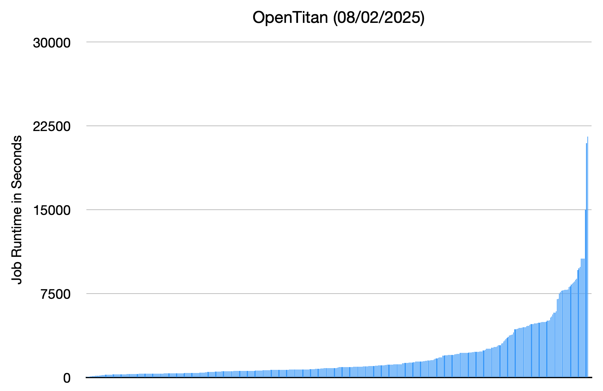

If you were to found a startup today that needed a significant amount of compute 
for running builds and tests, you'd likely look toward one of the major cloud 
providers. With their attractive startup credit packages, discounted rates for 
new companies, and seemingly endless compute resources, it’s definitely an easy 
choice — one that can scale with your needs over time. For small, ephemeral VMs, 
this model likely makes a lot of sense. However, this approach doesn’t work for 
every workload, and it provides a strong incentive to consider on-premise compute.

## Setting the Scene

Modern silicon engineering teams often take pride in their "software driven"
approaches to design and verification and many aspects such as version control,
continuous integration, build flows, and more can map well into the hardware
domain. However, silicon is constrained (primarily by physics) in ways that 
software just isn't and this leads to a distinct compute requirement difference
between the two domains.

Take unit testing as an example:

 * On the software side a small section of the code, perhaps just a single function,
   can be exercised by a small test routine. The resources of running this test
   are minimal and it will complete quickly;
 * On the hardware side, the smallest viable unit likely involves compiling and
   simulating a module of RTL and comparing its behaviour against a software 
   model. When you take into account running the simulator, the model, and the 
   test framework this will necessarily add up to a significantly larger resource 
   footprint.

But simulation is only the first step - when you start to construct the full flow 
of clock and reset domain (CDC) crossing analysis, synthesis, place-and-route (PnR),
design-for-test (DFT) insertion, timing analysis, parasitic extraction, power 
simulation, design rule checking (DRC), and more the compute needs continue to 
mount up and each step in the process can require huge CPU, RAM, and storage 
requirements.

## Focussing on Workloads

A number of vendor tools offer synthesis, PnR, timing, and power analysis in an 
integrated workflow. As both the tools and technologies are protected by strict 
NDAs, the numbers here must be deliberately vague:

 * Modern process design kits (PDKs) require around a terabyte of disk space,
   and must be kept on fast, networked storage to avoid bottlenecking down jobs 
   that depend on them;
 * Such an integrated tool working on a reasonable sized (~1 million gate) design 
   can, at points in the analysis, operate in a highly parallel fashion - so 
   consuming 8 cores and 64 GB RAM is not unreasonable;
 * Execution time for a single pass can take around a day of uninterrupted compute.

As your team grows and gets busier you won't be running just one of these such 
jobs - you'll be running as many passes possible as the design is refined to 
optimise timing, power consumption, and area. As your overall project grows, 
you'll be running multiple such trials in parallel and introducing progressively 
larger assemblies of these building blocks. Many modern ASICs are approaching 
reticle size - Graphcore's Mk2 processor (now a few years old) clocked in at a 
record-setting 59.4 billion transistors, or roughly 15 billion gates, 15,000 
times larger than the 1 million gate design considered above.

## Building Compute

Let's wind back a bit, your startup likely won't be assembling a reticle sized
chip for a year or two so let's focus on the more immediate future. You need
compute, it needs to be easy to manage, and you want the best bang for your buck.

This is exactly the situation we found ourselves in when setting up VyperCore's 
compute farm two years ago - within the team we had some experience with managing
servers and infrastructure, but it was still a daunting task. The choices we made
turned out to provide a solid capability at great value for money, but with 
hindsight there were some choices we'd reconsider. What follows details the 
choices we made, how it worked out, and what I'd do differently if given the 
chance.

### Provide Decent Laptops

Before building a compute farm, remember that each member of your team can have 
a powerful device at their fingertips that can beat the responsiveness of any 
centralised solution. Our team primarily used Apple MacBook Pros, selected for
their performance and power efficiency, but there are many options out there.

Avoid buying the cheapest laptops available - they will frustrate your team,
slow them down, and centralised compute will not make up for this. You will need
to design your flows and processes to deploy well onto machines that you have
less control over - there are plenty of ways to do this, which will likely be 
the topic of future posts to this blog!

### Sizing Up

Before you get out the credit card, take some time to identify the types of 
workloads you're likely to run and how much resource they might take. Of course,
if you're right at the start of a project you may not yet have data to back this
up - so as a _very_ rough rule of thumb:

 * For frontend jobs budget 1 core and 4 GB of RAM per concurrent test - RTL
   simulations are often single threaded and can often have a significant memory
   footprint due to the simulation, model, and testbench involved;
 * For backend jobs such as synthesis and PnR budget 8 cores and 64 GB of RAM
   per concurrent trial - backend tasks often need to load large parts of the
   PDK into memory, and runtimes can benefit from added parallelism especially
   in larger designs.

Determining how the quantity and mixture of jobs you will run depends on your
project, and the desired level of parallelism will be set by how long you deem
acceptable to wait for test results. To provide some measure of scale, the
[OpenTitan project dashboard](https://opentitan.org/dashboard/index.html) reports
a total of 2956 jobs executed. Their test results dashboard reports the 464 jobs 
with a mean execution time of 32 minutes, although 327 (70%) of these jobs 
complete in less than half an hour.

    

### Cost Considerations

If we want to run this test suite in under an hour (assuming that all jobs follow 
our rule of thumb of 1 CPU core and 4 GB RAM per simulation) then, using a 
[simple bin packing algorithm](./packing.py), we'll need 179 cores  and 716 GB of 
RAM. If we have a team of 10 engineers, then with regular PRs and overnight 
testing it would not be unreasonable to assume we'll need this capacity almost 
constantly.

So how much would this cost us in the cloud, opting towards fewer large machines
so that we can also use them for our other jobs such as synthesis. Each box here
is provisioned as 32 vCPU, 128 GB RAM, with 1 TB storage, located in a London
data center to comply with various export controls:

 * **Google Cloud:** $1,355/month or $661/month with a 3 year commitment (machine 
   configuration `n4-standard-32`);
 * **AWS:** $1,037/month or $603/month with a 3 year commitment (machine configuration
   `m6g.8xlarge` with shared instance tenancy).

So we'll need 6 of these instances for our theoretical compute load, running a 
whopping $3,966/month (£2,951/month, $48k or £35k a year!) even with a 3 year 
commitment. Ouch. To put this in perspective, this is similar to a graduate 
engineer's entire salary in the UK.

Now admittedly we could use shared storage here between the nodes so that they
don't have such large individual disks, and that will be a bit cheaper. However,
we also haven't budgeted for data ingress/egress costs (which can be pricey) so
let's call that even.

One argument often raised when opting for the cloud is that it comes with a lower
support burden, and this is definitely true from the viewpoint that you're not
responsible for a hardware failure. However you still need to provision the VMs, 
manage software updates, diagnose and fix OS problems when they occur, operate a 
robust backup strategy, and its a fallacy that this somehow comes for free.

### What We Built

We purchased eight high-end desktops each equipped with an AMD Ryzen 9 7950x CPU, 
128 GB of RAM, and 4 TB of NVMe SSD storage. Opting for consumer gear may seem
like an odd choice, however these CPUs offer much higher per-core performance
compared to their server-focussed counterparts - from Geekbench 6 scores:

 * [AMD EPYC 9124](https://browser.geekbench.com/processors/amd-epyc-9124) - 
   1832 single core, 13428 multi-core (launch MSRP of $1083)
 * [AMD Ryzen 9 7950x](https://browser.geekbench.com/processors/amd-ryzen-9-7950x) - 
   2985 single core (+63%), 19465 (+45%) multi-core (launch MSRP of $699)

Of course artificial benchmarks only capture one aspect of a compute platform - 
in some less favourable comparisons:

 * These desktop class chips top out at 128 GB RAM (vs 6 TB for the EPYC) and 
   can only achieve 3600 MT/s in this configuration (vs 4800 MT/s for the EPYC);
 * Similarly, the 7950x can support up to 24 lanes of PCIe 5 while the EPYC can 
   sustain 128 lanes.

The base configuration of eight systems we deployed were:

 * Case: Fractal Define 7
 * CPU: AMD Ryzen 9 7950X
 * Motherboard: ASUS ROG STRIX X670E-A
 * RAM: 128 GB DDR5
 * Storage: 4 TB NVMe
 * PSU: Corsair 650W 
 * Networking: ASUS XG-C100C 10 Gb/s
 * Total (as of 26/08/24): £1,877 (via PC Specialist)

Not all 8 systems were used for compute - one system was setup to host services 
such as Jenkins CI and GitLab for version control, while a second system was 
configured as a storage node so had the following additional components:

* 8x 12 TB Seagate IronWolf Pro NAS drives (these do well in 
  [Backblaze’s storage metrics](https://www.backblaze.com/blog/backblaze-drive-stats-for-q2-2023)): 
  8x£230 = £1,840.00 (Amazon as of 26/08/24)
* Broadcom SAS-3008 HBA controller £110.99 (https://amzn.eu/d/4E5r0iC)
* 2x Corsair MP600 Elite 2 TB NVMe drives (used as read and write cache layers): 
  2x£134.99 = £269.98 (Amazon as of 26/08/24)

In addition to the compute nodes, we also needed:

 * Network gateway (£570) - [Ubiquiti Cloud Gateway Ultra](https://uk.store.ui.com/uk/en/category/all-cloud-gateways/products/ucg-ultra)
 * 24-port 10 GbE switch (£95) - [Ubiquiti Pro HD 24](https://uk.store.ui.com/uk/en/category/all-switching/products/usw-pro-hd-24)
 * 4x1600VA UPS (£1,588) - [Eaton Ellipse Pro 1600VA](https://upscentre.co.uk/onlinestore/product/eaton-ellipse-pro-1600va-1000-watts-ups)

Bringing total spend to just shy of £20k ($27k) and when amortised over the same
three year commitment as the cloud services this runs at £541/month ($727/month).

Estimating power consumption at roughly 300W per system (TDP of a AMD 7950x is 
170W, so 300W allows for overheads of the rest of the system) running at full 
tilt these 8 systems will suck back 1,728 kWh per month. At current business 
energy rates of [25p/kWh](https://octopus.energy/business/tariffs/), this will 
cost an additional £432/month.

An internet connection is another must, but shopping around you can get a symmetric
1 Gb link from [YouFibre](https://business.youfibre.com/small-business/) from
£66/month.

Adding this all up brings the total monthly spend to **£1,039/month** - just 
**35%** of the cost of running the same compute in the cloud!

*VyperCore built out the compute in September 2023, but the costs in this section
are dated from August 2024 when we considered moving to the cloud.*

### Flaws and Bottlenecks

No deployment is perfect, and over the 2 years we worked with the compute farm 
certain flaws and bottlenecks became apparent:

 1. **Performance of the shared storage:** The ZFS storage array was configured 
    as RAID-Z2 with one SSD providing a fast ZFS Log drive and the other an 
    L2ARC read cache. In truth, this offered a surprising level of performance 
    for storage backed by spinning rust, but could be swamped if too many LLVM 
    builds kicked off simultaneously leading to a slow down across the pool due 
    to the nature of the small random file accesses in the compilation. 

    In hindsight, it would have been better to deploy either a fully SSD based 
    storage array or a tiered solution where SSD storage supported active working 
    directories for compilation, simulations, etc and bulk data storage was 
    provided by a HDD array. Such tiered solutions are supported by 
    [TrueNAS](https://www.truenas.com/m-series) and can offer cost-effective 
    high-performance storage without compromising on capacity.

 2. **Desktop PC cases:** PC cases really not ideal for large numbers of harddrives 
    as they're fiddly to work in and don't offer sufficient airflow to keep large 
    numbers of drives cool, and we experienced a few drive failures as a result. 
    Instead, this is an area where deploying a more enterprise focussed 
    rack-mounted solution would have been the better choice (although more costly).

 3. **Lack of out-of-band management (IPMI/LOM):** This is a common feature of 
    most server platforms allowing you to access the machine at a low-level if 
    the operating system locks up. We mostly addressed this issue by running 
    Proxmox as a hypervisor on all systems, which provided most of the  benefits. 
    However, there are ways to address this as a number of standalone IP-KVM 
    products exist that offer the same features - some examples are:

      * PiKVM - an IP-KVM built around a Raspberry Pi 
        [£315 at The Pi Hut](https://thepihut.com/products/pikvm-v4-plus)
      * TinyPilot Voyager 2a
        [$400 direct from their site](https://tinypilotkvm.com/product/tinypilot-voyager2a)
      * JetKVM - a glossy little IP-KVM
        [$69 via KickStarter](https://www.kickstarter.com/projects/jetkvm/jetkvm)

### Enterprise Grade

Another option of course is to deploy rack-mount servers from vendors like HPE, 
Dell, or SuperMicro - these are generally more robust than consumer gear, and 
can scale beyond the RAM and PCIe channel limits of desktop grade CPUs. However,
they can come at a _much_ higher price tag and as they're loud they will need a
dedicated server room.

For example, a 2U SuperMicro server equipped with 2x AMD EPYC Turin 9355 (32 core,
3.55 GHz, 256 MB cache) and 512 GB RAM (as 8x64GB DDR5 6400MHz ECC) and a single
480 GB M.2 boot drive, will set you back £12.5k. This machine on paper offers 
four times the compute of the desktop machines discussed above, although in 
practice with its higher cache and memory bandwidth it may outperform this, and 
with ECC RAM and server-grade parts it will likely be more robust to sustained
intense use. However, it would appear to come at a £5k premimum over the high-end
desktop approach but is still cheaper than renting this capacity in the cloud (an 
equivalent instance in Google Cloud, `n4-highmem-64`, costs £1,142/month with a 
three year commitment).

## Wrapping Up

The economics of deploying on-premise compute are clearly appealing - from the 
numbers presented one could save thousands a month over a long enough timeframe. 
However, bringing compute on-site comes with other complications of administering 
and monitoring the equipment. Deciding whether to deploy high-end desktops or
opting for enterprise-grade gear will come down to your appetite of risk versus
cost-effectiveness, and a mix of the two approaches (enterprise grade gear for
key services and storage infrastructure and desktop machines as compute nodes)
may be a pragamatic compromise.

In a future post, I’ll dig more into how VyperCore deployed and managed these 
systems in what we believe is a flexible and extensible manner. This will include
some philosophy on managing shared infrastructure, and detail some of the amazing
tools out there to help you manage such systems.

## Thoughts or Comments?

Reach out to me on [GitHub](https://github.com/Intuity) or 
[LinkedIn](http://linkedin.com/in/peter-birch-bristol), I'd love to hear from you.

## Attributions

Photo by [İsmail Enes Ayhan](https://unsplash.com/@ismailenesayhan?utm_content=creditCopyText&utm_medium=referral&utm_source=unsplash) on [Unsplash](https://unsplash.com/photos/brown-wooden-hallway-with-gray-metal-doors-lVZjvw-u9V8?utm_content=creditCopyText&utm_medium=referral&utm_source=unsplash)
