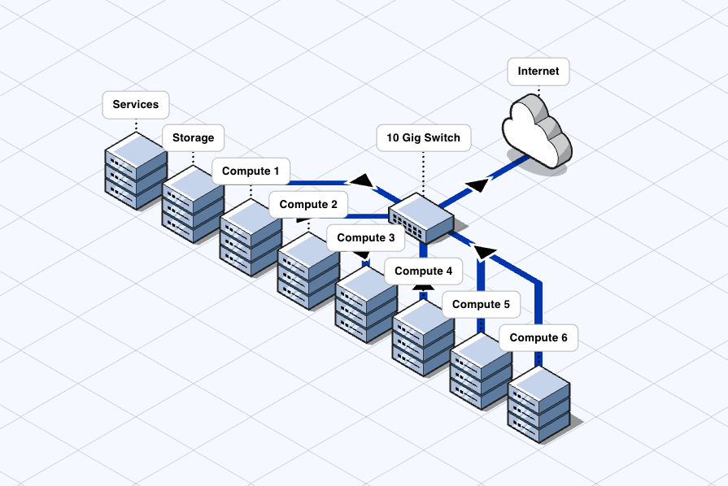

So let's say you [read my previous post]()
and you're thinking that on-premise compute might be what you need, and you're 
now staring down the challenge of setting it up to work for a silicon engineering 
team. Heck, even if you're going to use the cloud this can still be a daunting 
task as the off-the-shelf scalable solutions such as Kubernetes are not a great 
fit. I can't say I have all the answers but I can tell you what we did, where it 
worked well, and what I'd improve if I had the chance to do it again.

This post will work through some of the key challenges and decisions that you
will need to make around centralised services, automation, monitoring, and 
clustering. You'll need different pieces at different stages of maturity, and you 
may well need to revisit past decisions as your project evolves.

## First Up, EDA is Old School

Before we get started it's worth addressing this particular elephant - and for 
anyone who's worked in the industry, this won't be much of a shock. Vendors still 
expect you to use RHEL (Red Hat Enterprise Linux) or a clone such as Rocky Linux, 
forget using the crowd favourites like Ubuntu. Their reasoning primarily comes 
down to stability, these are slow moving releases with well known package lists 
and long support windows.

If you're planning to share compute between software and hardware engineers, you'll
need to decide very early on how to deal with this. RHEL and Rocky are not great
software development targets, libraries and tools are often very old versions and
you'll find many frameworks just lack support - as one example, 
[Bazel's hermetic LLVM builds simply don't support Rocky/RHEL 8](https://github.com/bazel-contrib/toolchains_llvm) 
due to its old libc version. 

One option is to create a hard division within your compute resource - software
goes in one pool, hardware in another. This is relatively easy to manage, but not
cost effective - compute can lie empty or see poor utilisation compared to what
can be achieved allowing a grid scheduler to operate over the entire farm.

Another option is to use containerisation - select a modern base OS such as Ubuntu
and then just run your EDA tools in compatible containers. Some vendors even provide
their own containers for this based on [Singularity](https://github.com/sylabs/singularity).
However, be prepared to wrangle this into life - EDA tools have some weird and
poorly documented dependencies as the vendors assume a standard RHEL environment. 
Also, you may have some difficult conversations to negotiate with vendors when 
looking for support - they may quickly point the finger at your non-standard 
execution environment.

My advice? Containerisation can be tricky, but it is worth it. Keep your tools
separated from your base OS and avoid "pollution" of dependencies when you need
to setup the next tool. Nothing is worse than installing a new dependency to get
a tool running to find this has broken some other part of your workflow - save
yourself the pain and isolate your tools.

## The Bare Bones

As detailed in [the previous post](), we
deployed 8 boxes - 6 for compute, 1 for storage, and 1 for services (which we'll
dig into soon). These connected via a 10 gigabit backbone with firewalled access
to the internet. This is a sizeable amount of compute for a small team, but is
no means a datacenter - but don't underestimate the task of keeping it running
smoothly!

     
    Figure 1: Raw compute nodes, switch, and networking

On all 8 nodes we installed [Proxmox VE](https://www.proxmox.com/en/) as a VM
hypervisor - initially we did this to compensate for the absence of IPMI/LOM
in consumer-grade hardware, but over time it proved itself a useful decision in 
many ways:

 * Allows VMs to be moved from host-to-host at relatively low effort, which is
   great when a key machine needs to be taken offline for servicing;
 * Offers efficient snapshotting of VM images at regular intervals, which can 
   then be rolled back very quickly - which proved useful more than once;
 * Supports "infrastructure-as-code" type roll-outs of new machine images, where
   the initial VM can be provisioned via [cloud-init](https://cloud-init.io).

Proxmox allows hardware-level passthrough of resources, so our storage node had
full control over the PCIe SAS controller as well as direct access to the 10 Gb
network interface - so this decision cost little in overall performance.

The six compute nodes each ran an Ubuntu 22.04 VM with most of the resources 
allocated into the VM (just one core and 4 GB RAM were left to Proxmox). The OS
install was kept as bare-bones as possible and jobs executed within Docker 
container based environments - this was done to avoid cross-contimation between
the wide variety of workloads we executed.

## Pets vs Cattle

At a previous company I worked with an oracle of an engineer who summarised 
management of compute resources as a "pets vs cattle debate". In short:

 * Pets - you care about each machine individually, it runs key services that 
   are not otherwise replicated, it will be a top priority to get it back online
   in the event of an outage;
 * Cattle - there are a large number of similar machines that can take over 
   workloads in the event that a machine has an issue, you care about the herd
   rather than any individual member.

While a brutal metaphor, this sums up the challenge quite well - pets are a lot 
of work but are vital to your success, while you have a lot of cattle and any 
one failure is not critical. You want a lot of cattle and few pets, if you find 
this balance the other way up then you have a maintenance problem brewing.

Of course, this does not mean you should trust your key data and services to a
single node - everything will fails given time, so have replicas and backups. Fairly 
early on we had a duplicate storage server at a remote site which had a copy of
all the VM snapshots and key data, and was also replicated to the cloud using 
[Backblaze](https://www.backblaze.com).

## Grand Central Services

To operate a productive engineering environment, you will need to setup a number
of centralised services. While many of these can be configured with failover
protection, their criticality classifies them as "pets". 

### Authentication

Centralised authentication for servers, storage, web apps, and more is a key
player in reducing friction for end users - once setup an account can be created
in a single place with a password and SSH key, then this can be immediately used
to login to any location on the network.

The key term to be aware of is
[LDAP (Lightweight Directory Access Protocol)](https://en.wikipedia.org/wiki/Lightweight_Directory_Access_Protocol),
this is the Linux equivalent to Window's Active Directory. Support for this is
baked deep into Linux, and many applications such as Jenkins and GitLab can work
seamlessly with it.

You can setup an LDAP server from scratch, but can be fiddly to setup requiring 
a deep understanding of how Linux queries the directory's structure and what 
attributes each record must offer. Fortunately, there are a few great options out 
there which can be rolled out quickly.

If you already run Google cloud services for your organisation, you can enable
[Google Secure LDAP](https://support.google.com/a/answer/9048516). This has the 
benefit of directly linking the users who can login to your systems with their
email accounts. However, the downside is that you can't customise the directory
structure and there are a bunch of neat tricks that LDAP can offer to manage your
servers.

A better option is to install [FreeIPA](https://www.freeipa.org) - this RedHat
supported project offers an out-of-the-box working LDAP server with a rich 
web-based user interface. Beyond user authentication, it also allows for rich
policy definitions, SSH key storage (which supports passwordless access to servers
and can also be auto-setup in tools like GitLab for SSH cloning), and automount
management (very useful for locating home directories on NFS shares).

Even if you do use Google cloud services, you can configure FreeIPA to use an
[external identity provider](https://freeipa.readthedocs.io/en/latest/designs/external-idp/external-idp.html)
and get the best of both worlds!

### File Storage

Shared file storage coupled with LDAP authentication will allow your team to
move seamlessly between machines. Their home areas can be automatically mounted
from a network share, and shared data and tools can be located in common paths
also located on shares.

If you're not familiar with network shares, their are really two key protocols:

 * [Samba or SMB](https://en.wikipedia.org/wiki/Samba_(software)) - is the 
   protocol that Windows machines primarily use, but can also be used on Linux
   and macOS;
 * [Network File System or NFS](https://en.wikipedia.org/wiki/Network_File_System) -
   is the preferred protocol for Linux network shares.

NFS supports much richer permission and ownership management than Samba as its 
internal model matches that of Linux. Samba is slightly easier to setup, but
you will quickly discover that permissions cannot be sensibly managed.

To offer network shares you will need a NAS (or Network Attached Storage) device, 
which exposes a shared storage pool to the network via NFS or Samba. As detailed 
in [the previous post]() we used a tower
PC with a SAS card, eight harddrives, and two SSD caches. 

On this box we installed [TrueNAS](https://www.truenas.com) to operate the pool
of storage - we configured our eight 16 TB HDDs into a pool with dual redundancy
(up to two drives could fail without dataloss), giving a usable capacity of 96 TB. 
TrueNAS uses ZFS, which being a journaled filesystem allows online snapshotting
and rollback - which can be a lifesaver if you need to retrieve a critical file
that's been accidentally deleted. TrueNAS is a truly incredible tool that you 
can run for free, and commercial support is available as and when your organisation
requires it.

The final tool to be aware of is [autofs](https://help.ubuntu.com/community/Autofs) 
which can be configured to mount network shares on demand when the user browses 
to certain paths on the filesystem. Autofs can be 
[configured through FreeIPA](https://www.freeipa.org/page/Client#integration) 
which makes it easy to add or update network shares over time across a cluster
of machines.

### Object Storage

Object storage is not necessarily a familiar technology to those in the EDA industry.
It offers a structured way to store large blobs such as RTL releases, physical 
build artefacts, or compiled binaries. [AWS S3](https://aws.amazon.com/s3) is 
the original and best known offering, but there are many compatible services such
as [Google Cloud Storage](https://cloud.google.com/storage) or 
[Backblaze B2](https://www.backblaze.com/cloud-storage). IBM offers an
[introduction to object storage](https://www.ibm.com/think/topics/object-storage)
which gives a good overview of the differences between it and traditional file
storage.

You can run object storage locally using [MinIO](https://www.min.io), which can
either be installed on standalone dedicated hardware or overlayed onto your
[TrueNAS SCALE](https://www.truenas.com/docs/scale/24.04/scaletutorials/apps/communityapps/minioapp/)
installation.

MinIO can be setup to 
[authenticate with LDAP](https://docs.min.io/enterprise/aistor-object-store/administration/iam/identity/ldap-identity/),
which provides a well integrated experience for your team.

We used our MinIO-based object store extensively - every single CI build pushed
its build artefacts into the store, tagged with metadata to identify the precise
build and git commit hash they came from. We used 
[retention policies](https://docs.min.io/enterprise/aistor-object-store/reference/cli/mc-retention/mc-retention-set/)
to automatically retire objects as they became irrelevant, minimising the 
required storage footprint - it quickly became key to our engineering process.

### Services

As your project grows, you'll likely find that you need to run an increasing
number of services to support your team - for example you might want to locally
host [GitLab](https://about.gitlab.com) for git repository hosting, 
[Jenkins](https://www.jenkins.io) for running complex CI pipelines, or 
[OpenProject](https://www.openproject.org) for bug and task tracking. 

You may choose to install each of these tools in its own VM, but this can quickly
silo your server resource into poorly utilised pools. Instead, consider deploying
tools like this as containers. For this you have a few choices, a couple of good
ones are:

 * [Proxmox's Linux Containers](https://pve.proxmox.com/wiki/Linux_Container)
   neatly integrates into the Proxmox GUI alongside your other VMs, you can
   download base images from Proxmox's repository and then install whatever
   tools you like.
 * [Portainer](https://www.portainer.io) will need to be installed onto a VM,
   but then provides web-based management of Docker containers. It has a community
   edition that is free to use but has a limited feature set.

Portainer has the benefit of the Docker ecosystem and its huge collection of
pre-built containers via [Docker Hub](https://hub.docker.com). Proxmox LXC is
basic by comparison, but avoids introducing further layers of management.

## Automation, Automation, Automation

As your compute farm grows, so will the maintenance burden of keeping the machines
in your cluster healthy and up-to-date. If you need to install a new tool, it
quickly becomes tedious (and error prone) to SSH into twenty different VMs and 
run the same commands. The best practice solution to this is defining your
["infrastructure as code"](https://en.wikipedia.org/wiki/Infrastructure_as_code).

Many tools exist to assist you in this task such as [Ansible](https://github.com/ansible/ansible), 
[Puppet](https://www.puppet.com), and [Terraform](https://developer.hashicorp.com/terraform).
These tools can do everything from 
[creating VMs in Proxmox](https://docs.ansible.com/ansible/latest/collections/community/general/proxmox_module.html),
to refreshing 
[SSH certificates](https://docs.ansible.com/ansible/2.9/modules/letsencrypt_module.html),
and 
[running software updates](https://docs.ansible.com/ansible/latest/collections/ansible/builtin/apt_module.html).

There are many books, blog articles, and YouTube videos out there for setting
up these various tools - [Jeff Geerling](https://ansible.jeffgeerling.com) has
a lot content on using Ansible, and similar exists for the other frameworks.

In all honesty, each of the solutions listed above is equally capable - just 
choose one that makes sense to you and start using it as soon as possible. It 
will be a steep learning curve, but time invested early on will be paid back 
tenfold as the size of your cluster grows.

From past experience, a good way to setup automations is to transcribe the manual
steps you perform as you set something up for the first time. Then, once you 
believe the automation is complete, immediately test it to see whether it can 
reproduce the same configuration and correct where necessary. It will help to 
have space on your servers for a spare VM or two to test automations against,
rather than immediately executing them against production infrastructure!

## Clustering

So you have a collection of machines all linked back to centralised LDAP 
authentication, with files stored on an NFS share served by TrueNAS, and your 
key services like Jenkins and GitLab are setup and running happily - we're all 
done right? Not quite.

If every member of your team can log directly into any machine in the farm and 
run jobs, you'll likely find that the utilisation of the overall resource is 
pretty poor. Some machines may end up oversubscribed because too many team 
members have selected it as their "favourite", while others will go unused. This
will also turn all of your machines into 'pets' rather than the 'cattle' you 
desire them to be.

A solution to this is to deploy a grid engine, where instead of logging into a 
specific machine a user 'schedules' their workload against the entire cluster - 
requesting a number of CPU cores, amount of memory, a maximum runtime, and any 
required licenses for each job. The clustering system then queues this workload 
until sufficient resource exists in the farm, before dispatching it to a machine. 
Jobs can run interactively or be submitted in 'batch' to run in the background, 
with logs and outputs stored to specified locations.

A number of different options exist for this - [Slurm](https://slurm.schedmd.com/documentation.html),
[SGE](http://star.mit.edu/cluster/docs/0.93.3/guides/sge.html), and 
[LSF](https://www.ibm.com/products/hpc-workload-management) offer a traditional
form of scientific compute clustering, while [Kubernetes](https://kubernetes.io)
and [Docker Swarm](https://docs.docker.com/engine/swarm/) come from the new era
of container-based distributed compute.

However, if you're using EDA tooling and require jobs to scale across your compute
farm (which is common practice for backend tools such as synthesis or place-and-route)
then Slurm is your best bet. Compared to SGE and LSF, Slurm is the newest of the
three, still under active development and support, and offers 'modern' features
such as a [REST API](https://slurm.schedmd.com/rest.html) for scheduling jobs.
It schedules jobs in the way vendor tools expect, interacting either natively or 
through SGE-like command wrappers.

Deploying Slurm is not the easiest task, but you can use automation extensions
such as [ansible-slurm](https://github.com/galaxyproject/ansible-slurm) to help
you.

You may want to look into setting up [control groups (cgroups)](https://slurm.schedmd.com/cgroups.html),
which strictly enforce the resource limits specified for a job when it was 
submitted to the scheduler. Without this, jobs can blow past the resources that
they specified and this can lead to sporadic failures or long runtimes.

When you've setup a clustering solution, you should consider disabling direct SSH
access to your servers as this will give the scheduler the best chance at balancing
resource requests. Your team can still schedule interactive sessions through the
clustering system, so there should be no loss of productivity. Continuing to
allow direct SSH access will prevent the scheduler from doing its job properly,
and can lead to oversubscription of resources which in turn can lead to machines
locking up or running slowly.

### A Sidebar on Kubernetes

Kubernetes has a rich ecosystem surrounding it, and is a tempting proposition 
for managing distributed compute. Given the previous recommendation for using
containers, you may be left wondering why I'm not equally recommending the use
of Kubernetes.

It effectively comes down to how tools work in an EDA environment, and there are
two main challenges:

 1. Kubernetes does not have native support for consumable licenses, which is 
    essential as you don't want your farm to fill up with jobs just waiting for
    licenses to become available. It might be possible to use 
    [custom resource definitions](https://kubernetes.io/docs/concepts/extend-kubernetes/#custom-resource-definitions)
    but I'm yet to find anyone online who's tried this.

 2. EDA tooling does not natively interact with Kubernetes. Many EDA tools will
    schedule worker processes across a cluster when performing large compute 
    tasks, for this they interact directly with the grid engine. It may be 
    possible to customise these launch procedures to invoke Kubernetes, but you
    will be on your own without vendor support.

## Monitoring

As your workloads grow in scale and complexity it's important to understand how
well your compute resource is being used and whether there are any bottlenecks.
If you're relying on `htop` on a machine-by-machine basis, its often hard to see
the wood for the trees - so it helps to have a single place to view metrics.

The [Cockpit Project](https://cockpit-project.org) is one option, it provides the 
ability to both monitor and control a collection of systems from a web-based GUI.
However, if you're using a solution like Ansible or Terraform then many of the 
features will go unused.

A more flexible alternative is to use [Prometheus](https://prometheus.io) for
metrics gathering and feed the data into [Grafana](https://grafana.com) - with 
this power couple you can define as many custom dashboards as you like, displaying
any number of metrics such as CPU, memory, and network load. You can also feed
in other information sources such as EDA license usage, temperature of your 
server room, and much more. 

There are many tutorials out there for setting up Prometheus, such as 
[this one on Grafana's website](https://grafana.com/docs/grafana/latest/getting-started/get-started-grafana-prometheus/).

As with many of these recommendations, this may feel overkill to begin with but
will pay dividends when your cluster slows down and you need to trace which 
machine is causing the problem. You'll likely be sensitive to issues that occur
with your 'pets' as they'll be rapidly visible across the team, but detecting
issues with a large number of 'cattle' is trickier as the issues may be sporadic.

## Wrapping Up

As you start to explore this problem, you'll realise that there are ten different
ways to tackle any one of the areas discussed here - my recommendations come from 
personal experience, but many other approaches are perfectly valid.

I'd recommend that you first focus on authentication, file storage, and adopting 
an infrastructure as code framework - getting these three in place early will 
make it much easier to scale up. As part of this, try to avoid setting up one-off 
or short-term solutions - they'll quickly become "sticky" and you'll struggle to
move on as soon as your team begins to rely on it.

## Thoughts or Comments?

Reach out to me on [GitHub](https://github.com/Intuity) or 
[LinkedIn](http://linkedin.com/in/peter-birch-bristol), I'd love to hear from you.
